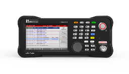
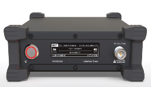
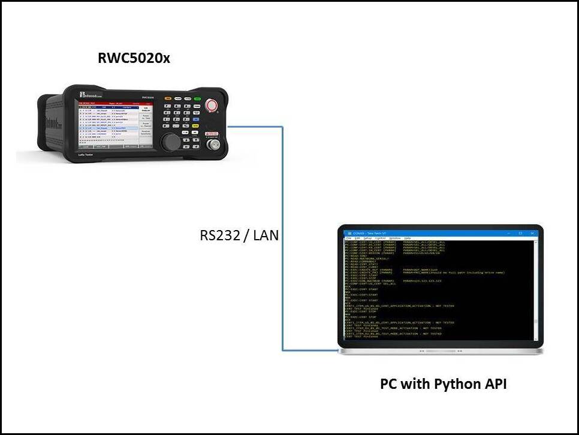

# rwc-python-api

This is a Python library to control the RWC5020x LoRa Tester remotely through either the serial port
(RS232) or the Ethernet port.

- **Supported analyzers (current generation):**

  | RWC5020B | RWC5020M |
  | :---: | :---: |
  | [](https://mcci.com/lorawan/products/rwc5020b/ "Link to RWC5020B page") | [](https://mcci.com/lorawan/products/rwc5020m/ "Link to RWC5020M page") |

- **Supported analyzer (previous generation):**

  | RWC5020A |
  | :---: |
  | [](https://mcci.com/lorawan/products/rwc5020b/ "Link to RWC5020A page") |

## Requirements

- [Python3.*](https://www.python.org/downloads/)
- [PySerial](https://pypi.org/project/pyserial/)

## API Setup



- To access RWC5020x tester using Python Library, please follow the setup shown in the diagram.

## How to install the package

1.  Clone the repository from [github](https://github.com/mcci-catena/rwc-python-api)
2.  Open a terminal window and change directory to `{path_to_repository}/rwc-python-api`.
3.  To install the library in your local Python setup, enter the command

    ```bash
    python setup.py install
    ```

## How to use the package

Create a Python file and import the class library from package:

```python
from rwclib.cRWC5020x import RWCTesterApi
```

Create a class object and pass serial port or ethernet port & ip address as constructor parameter

```python
# ---Serial Communication---
rwc = RWCTesterApi('COM5') #windows
(or)
rwc = RWCTesterApi('/dev/ttyUSB0') #Linux

# ---Ethernet Communication---
rwc = RWCTesterApi('5001', '192.168.0.33')
```

Access the class methods using instantiated object

```python
rwc.query_identification()
```

To know more about class methods, please see the **code documentation** in the following location in this repository: [`./doc/build/html/index.html`](doc/build/html/index.html)

Example scripts showing how to use the library can be found in the [`examples`](./examples) directory.

## Support

The Python library supports RWC5020x firmware from v1.150 to latest version (v1.310 at time of release).

## Release History

- v1.0.4 has the following changes:
  - Fix [#6](https://github.com/mcci-catena/rwc-python-api/issues/6): Added new remote commands for the latest firmware v1.310

- v1.0.3.10 includes the following changes:
  - Fix [#2](https://github.com/mcci-catena/rwc-python-api/issues/2): Updated latest remote commands and added backward compatibility to python library for support of RWC5020x firmware from v1.150 to v1.305.
